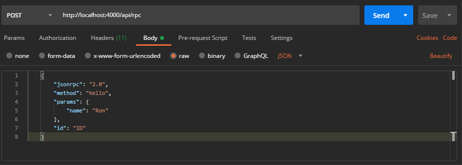
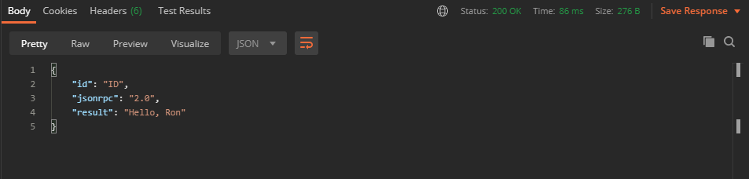

# PhxJsonRpc


Simple implementation of JSON-RPC server, written in [elixir](https://elixir-lang.org/) and working with [phoenix](https://www.phoenixframework.org/).

Allows you to define any number of rpc endpoints, which can be accessed via http protocol.

## How it works

The package uses router `macro` for matching RPC calls to your end-user service.

It uses `JSON SCHEMA` as a specification for your services and provides parsing, validation and error handling briefly.

Requests can be served in batches with asyncronous order.

To start handling requests with phoenix:

1. Define rpc router

```elixir
defmodule MyApp.Rpc.Router do
  use PhxJsonRpc.Router,
    otp_app: :rpc_router,
    schema: "[PATH_TO_YOUR_SCHEMA]",
    version: "2.0",
    max_batch_size: 20

  alias MyApp.Service

  ## Service routes
  rpc("hello", Service, :hello, "#/components/schemas/Greeting")
end
```

2. Use handler in any web controller

```elixir
defmodule MyAppWeb.RpcController do
  use MyAppWeb, :controller

  alias MyApp.Rpc.Router

  def rpc(conn, request) do
    response = Router.handle(request)
    render(conn, "response.json", response)
  end
end
```

3. Import helpers inside your view

```elixir
defmodule MyAppWeb.RpcView do
  use MyAppWeb, :view

  import PhxJsonRpc.Views.Helpers

  def render("response.json", %{response: response}) do
      render_json(response)
  end
end
```

4. Ensure your service module is defined and it's methods described in json-schema

```elixir
defmodule MyApp.Service do
  @moduledoc "My service"

  def hello(%{"name" => name}) do
    "Hello, #{name}"
  end
end
```

See [quick start](#quick-start) and [documentation](#documentation) section for more detail.

Request and response using postman:





## Installation

The package can be installed
by adding `phx_json_rpc` to your list of dependencies in `mix.exs`:

```elixir
def deps do
  [
    {:phx_json_rpc, "~> 0.3.4"}
  ]
end
```

This package depends on [ex_json_schema](https://github.com/jonasschmidt/ex_json_schema) for validation purposes.

## Quick start

Please see this [guide](https://hexdocs.pm/phx_json_rpc/PhxJsonRpc.html) for usage with phoenix.

## Documentation

The docs can be found at [https://hexdocs.pm/phx_json_rpc](https://hexdocs.pm/phx_json_rpc).

## Links

The package creation was inspired by some other repos:

- [json-rpc-laravel](https://github.com/avto-dev/json-rpc-laravel)
- [open-rpc](https://github.com/open-rpc/)
- [phoenix1.4-json-rpc](https://github.com/vruizext/phoenix1.4-json-rpc)

## License

MIT. Please see the [license file](LICENSE.md) for more information.
